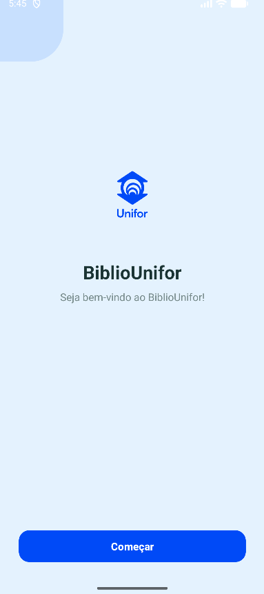
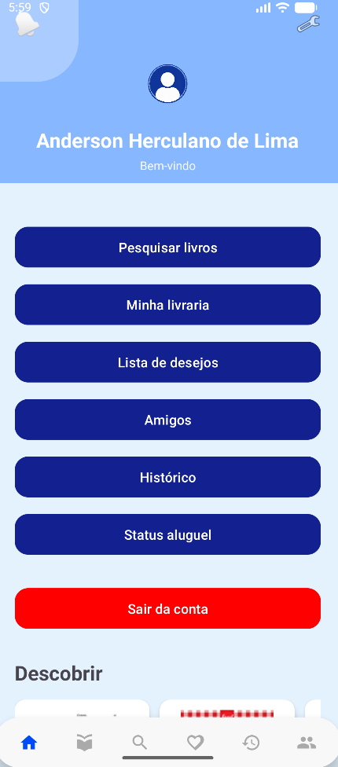
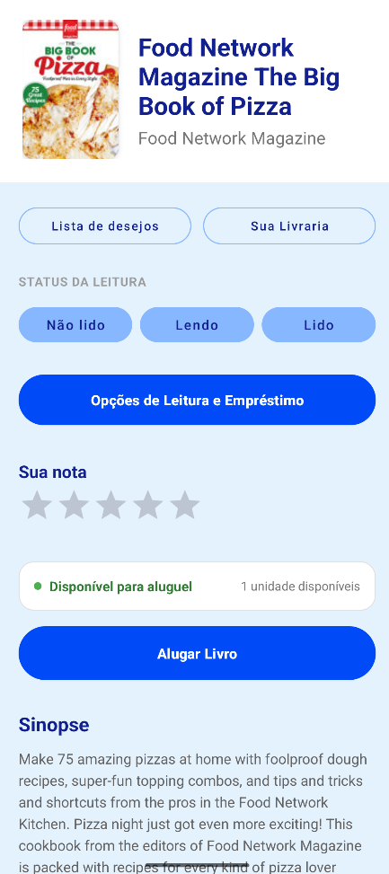
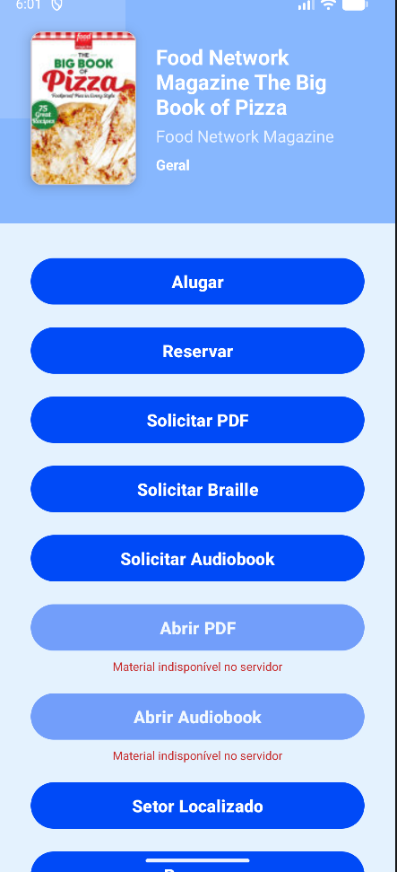
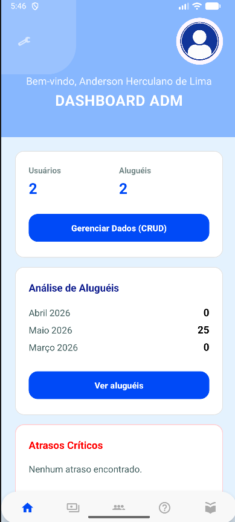

[Desenvolvimento de Plataformas Móveis - Devs AB (1) (1).pdf](https://github.com/user-attachments/files/28464447/Desenvolvimento.de.Plataformas.Moveis.-.Devs.AB.1.1.pdf)
<div align="center">


# BiblioUnifor

### *Sua biblioteca universitária na palma da mão.*

[](https://developer.android.com)
[](https://kotlinlang.org)
[](https://firebase.google.com)
[-blue?style=for-the-badge)](https://developer.android.com/about/versions/pie)
[](https://github.com/brenalemos09/BiblioUnifor_DEV_AB/releases/latest)
[](https://github.com/brenalemos09/BiblioUnifor_DEV_AB/releases/latest)

</div>

---

## 📖 Sobre o Projeto

O **BiblioUnifor** é um aplicativo Android nativo desenvolvido para modernizar a experiência de uso da biblioteca universitária da UNIFOR. A solução digitaliza todo o fluxo — do cadastro do aluno ao gerenciamento de acervo pelo administrador — eliminando filas, formulários físicos e processos manuais.

O app possui **dois perfis de acesso distintos**: o aluno, que pesquisa, solicita empréstimos e acompanha seu histórico; e o administrador, que gerencia o acervo, os usuários e os empréstimos em tempo real.

> Projeto acadêmico desenvolvido na disciplina **Desenvolvimento de Plataformas Móveis (T197-12)** — UNIFOR 2026.1, Professor Thiago Narak. Grupo 4.

---

## ✨ Funcionalidades Principais

### 👤 Área do Aluno

| Funcionalidade | Descrição |
|---|---|
| **Autenticação completa** | Cadastro, login, recuperação de senha com código de validação por e-mail |
| **Dashboard personalizado** | Tela inicial com acervo em destaque, categorias e acesso rápido às principais ações |
| **Busca inteligente** | Pesquisa de livros integrada à **Google Books API**, com resultados em tempo real e filtros por categoria |
| **Detalhe do livro** | Página dedicada com sinopse, avaliações de outros leitores, disponibilidade e opções de leitura |
| **Solicitação de empréstimo** | Fluxo completo com seleção de datas via calendário, termos de uso e confirmação |
| **Acompanhamento de status** | Rastreie em tempo real o estado do seu empréstimo: pendente, aprovado, renovado ou devolvido |
| **Minha Livraria** | Acervo pessoal com os livros atualmente em posse do aluno |
| **Lista de Desejos** | Salve livros de interesse para consulta e solicitação futura |
| **Rede de Amigos** | Adicione colegas, visualize perfis e acompanhe as leituras da sua rede |
| **Histórico** | Registro completo de todos os empréstimos realizados, com busca e navegação por item |
| **Notificações Push** | Alertas em tempo real via **Firebase Cloud Messaging** para prazos, aprovações e devoluções |

### 🛡️ Área do Administrador

| Funcionalidade | Descrição |
|---|---|
| **Dashboard ADM** | Painel com visão geral de empréstimos vencidos, atividades recentes e métricas da biblioteca |
| **CRUD de Livros** | Cadastro completo de obras com título, autor, capa, mídias extras (PDFs, áudios) e calendário de publicação |
| **Gerenciamento de Usuários** | Visualize, ative ou desative contas de alunos; consulte os livros alugados por cada usuário |
| **Gestão de Solicitações** | Aprove, rejeite ou renove empréstimos diretamente pelo painel, com visualização de calendário |
| **Painel Financeiro** | Acompanhamento de multas e receita proveniente dos empréstimos |
| **Gestão de Contas ADM** | Criação e gerenciamento de contas administrativas com fluxo seguro de confirmação |

---

## 🖼️ Interface & Design

> As capturas de tela abaixo ilustram as principais telas do aplicativo.

<div align="center">

| Boas-vindas | Dashboard Aluno | Detalhe do Livro |
|:-----------:|:---------------:|:----------------:|
|  |  |  |

| Pesquisa | Solicitação | Dashboard ADM |
|:--------:|:-----------:|:-------------:|
|  |  |  |

</div>

---

## 🛠️ Tecnologias Utilizadas

### Linguagem & Plataforma
- **Kotlin 2.0** — linguagem principal, com coroutines e KSP
- **Android SDK 35** (target) / **SDK 28** (mínimo, Android 9+)

### Backend & Dados
- **Firebase Authentication** — login, cadastro e recuperação de senha
- **Firebase Firestore** — banco de dados NoSQL em tempo real para livros, usuários e empréstimos
- **Firebase Storage** — upload e armazenamento de capas, PDFs e mídias
- **Firebase Cloud Messaging (FCM)** — notificações push
- **Room Database** — persistência local para cache de dados offline

### Rede & APIs
- **Retrofit 2 + OkHttp 4** — cliente HTTP para consumo de APIs REST
- **Gson Converter** — serialização/desserialização de respostas JSON
- **Google Books API** — catálogo externo de livros com metadados completos
- **Google Play Services Auth** — autenticação via conta Google

### UI & Experiência
- **Material Design 3** — componentes visuais modernos e consistentes
- **Coil 2.7** — carregamento assíncrono de imagens por URL
- **ConstraintLayout + AppCompat** — layouts responsivos e compatíveis

---

## 🚀 Como Executar o Projeto

### Pré-requisitos

- [Android Studio Hedgehog](https://developer.android.com/studio) ou mais recente
- JDK 11+
- Conta no [Firebase Console](https://console.firebase.google.com) (para configurar o backend)
- Chave de API do [Google Books API](https://developers.google.com/books/docs/v1/using#APIKey)

### Passo a Passo

```bash
# 1. Clone o repositório
git clone https://github.com/brenalemos09/BiblioUnifor_DEV_AB.git

# 2. Acesse o diretório do projeto
cd BiblioUnifor_DEV_AB
```

**3. Configure o Firebase:**

- Acesse o [Firebase Console](https://console.firebase.google.com) e crie um projeto Android com o package `com.example.bibliounifornew`
- Baixe o arquivo `google-services.json` e substitua o existente em `app/google-services.json`

**4. Configure a chave da Google Books API:**

Crie ou edite o arquivo `local.properties` na raiz do projeto e adicione:

```properties
GOOGLE_BOOKS_API_KEY=SUA_CHAVE_AQUI
```

> O arquivo `local.properties` está no `.gitignore` — nunca commite suas chaves.

**5. Abra no Android Studio:**

- `File → Open` → selecione a pasta do projeto
- Aguarde o Gradle sincronizar as dependências
- Conecte um dispositivo físico (Android 9+) ou inicie um emulador
- Clique em **Run ▶** ou use `Shift + F10`

---

## 📲 Como Baixar e Testar o APK

> Esta seção é destinada ao professor e à banca avaliadora.

### Opção 1 — GitHub Releases (Recomendado)

1. Acesse a página de releases do projeto:
   **[github.com/brenalemos09/BiblioUnifor_DEV_AB/releases/latest](https://github.com/brenalemos09/BiblioUnifor_DEV_AB/releases/latest)**

2. Localize o arquivo `BiblioUnifor-v1.0.apk` nos assets da release

3. Clique em **Download** para baixar o APK

---

### Instalação em Dispositivo Físico

> **Requisito:** Android 9 (API 28) ou superior

```
Passo 1 — Habilite fontes desconhecidas:
  Configurações → Segurança → "Instalar apps desconhecidos"
  → Selecione seu navegador/gerenciador de arquivos → Ative

Passo 2 — Abra o APK baixado no gerenciador de arquivos
           e toque em "Instalar"

Passo 3 — Aguarde a instalação e toque em "Abrir"
```

---

### Instalação via ADB (Emulador ou Dispositivo USB)

```bash
# Certifique-se que o ADB está instalado e o dispositivo conectado
adb devices

# Instale o APK
adb install BiblioUnifor-v1.0.apk
```

---

### Credenciais de Teste

Para facilitar a avaliação, utilize as credenciais abaixo:

| Perfil | E-mail | Senha |
|--------|--------|-------|
| **Aluno** | `aluno.teste@unifor.br` | `Teste@123` |
| **Administrador** | `adm.teste@unifor.br` | `Adm@123` |

> Caso as contas acima não estejam ativas no ambiente de produção, crie uma conta normalmente pela tela de cadastro do app.

---

## 👥 Autores

<div align="center">

Desenvolvido com dedicação por **DevsAB** ✦ UNIFOR 2026.1

| | Nome | GitHub |
|:-:|------|--------|
|  | **Anderson Lima** | [@AndersonCrush](https://github.com/AndersonCrush) |
|  | **Brena Aguiar** | [@brenalemos09](https://github.com/brenalemos09) |

</div>

---

<div align="center">

**BiblioUnifor** • UNIFOR 2026.1 • Grupo 4

</div>
